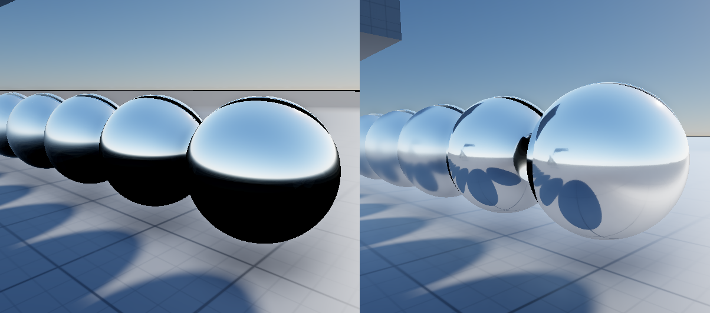
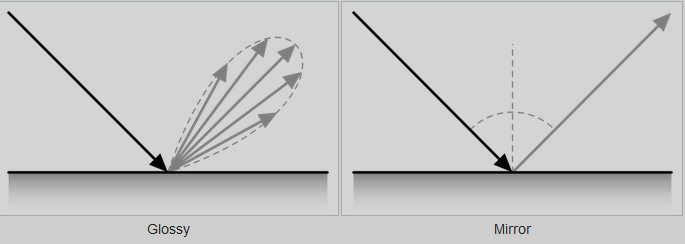

+++
author = "Xavier Amado"
title = "Spark: Raytraced Reflections"
date = "2026-05-18"
description = "Realtime raytraced reflections"
tags = [
    "spark",
    "rendering",
    "graphics"
]
categories = [
    "spark",
]
series = ["Spark"]
+++

On the left side we have a standard IBL PBR, in this case using the actual environment from my atmospheric scattering implementation, but it could also be using any HDRI cubemap. On the right, we have the next stepping stone, local reflections. Should be an easy improvement to implement... right? Yeah... no...



# So what are reflections? 

(A very quick and dirty explanation)

To solve the lighting equation we need to integrate the light incoming from all possible directions, and in order to do that, we have to evaluate the BRDF for the material. Now light is not just the analytical lights (directional, point, spot, etc), but everything in the surrounding environment contributes light... light bounces around, until all its energy is absorbed or (in our case the important part) it reaches the eye/camera.

When light interacts with a surface it can be separated in two parts, the diffuse component, and the specular component. The diffuse component is view independent, whilst the specular portion of it is view dependent, and this last part is what we are looking at here.

So what are reflections? Well, the specular component of the indirect lighting.

# Raytracing

In order to calculate the specular reflections of the indirect lighting, we need to be able to know what light is incoming from a specific direction. When doing this with cubemaps (for IBL) you would sample the cubemap in said direction, and be done with it. Now if we want real reflections, we need another approach, and in this case, we are going to be using raytracing.

So just calculate the reflection vector, shoot a ray, see what it hits and boom, done! Right?



Well, not quite. That is only true for mirrors. In the above image we shoot rays in the perfect reflection direction, and then blend the result in the final image.

You see, when light hits a surface it interacts with the microfacets of the surface, if the surface is a perfect mirror, then yes, there's always one reflection vector, but on a rough material the surface is made up of tiny microfacets pointing in different directions, so light reflects in a spread of directions rather than a single one. The higher the roughness, the wider the spread.



So, in raytracing in general, how do we know which rays will reach the camera? We can't possibly shoot hundreds and hundreds of rays in hopes we get hits. Instead we do the opposite, we walk rays backwards, so we shoot a ray from the camera, sample the BRDF at the hit point to get a reflection direction, and trace that secondary ray to see what else gets hit, and that will be the color we use for our reflection.

In a hybrid renderer the first step is not necessary, since we are using a rasterization pipeline, so we already know the main hit, we just need to trace the secondary hit.

For tracing the secondary ray we use GGX VNDF importance sampling (Visible Normal Distribution Function) to generate a reflection direction. This ensures we always sample microfacet normals on the visible side of the hemisphere — no wasted samples on normals facing away from the camera. For a rough surface, this gives us one of the possible directions, and this is what we would get:



Not very pretty is it? With the mirror case, we knew exactly what direction the rays would follow, but with a roughness higher than 0 we are only tracing one of the possible directions... So, can we trace more rays? Sure...



As you can see, the image quality improves, but it's still very noisy... remember, we don't know what directions light travels, we are just guessing or sampling a finite set.

So why not trace more and more rays? Well, performance of course! This is where it gets tricky, we get diminishing returns for very high performance costs.

A 1080p buffer is 1920x1080, that is 2,073,600 pixels... so at 1spp, that's 2,073,600 rays. At 8spp, that's a whopping 16,588,800... 16.5 million rays! This is getting out of hand!

# Let's be smarter

So bruteforcing this won't work, we need to science the shit out of this.

For my case, I will stick with 1spp, so just 1 ray per pixel. So how do I get better information?

Well, here's the thing, if we shoot 1 (somewhat random) ray per pixel, per frame, we have valuable information we are throwing away every frame... if we could somehow reuse the rays we shot last frame.... wait a minute, that's not such a crazy idea!

If we shoot 1 ray each frame, but we accumulate the results, we are going to get more information, the first frame we have 1 ray, the second frame we have 2 rays, with N frames we have N rays... each frame we blend the new sample with the accumulated history, so the image progressively refines.

But this doesn't work for us, we are making games, so the camera moves, if we were to do this accumulation naively we would get horrible ghosting. In a realtime 3d game or renderer the camera does move, but it usually does smoothly, the image doesn't change considerably from one frame to the next, so can we still use the information from the last frame? 

# Temporal Accumulation (or Temporal Reprojection)

So if the camera rotates a few angles between 2 frames, the surfaces being rendered are mostly the same, they just are in different pixel coordinates, so if we can figure out where the point of a surface at a specific pixel this frame was in the screen in the previous frame, then we can reuse those ray results.

This is called reprojection. During the depth prepass, each vertex is projected to screen space using both the current frame's view-projection matrix and the previous frame's view-projection matrix. The difference between these two screen positions is written per-pixel into a "Motion Vectors" texture in NDC space. Later passes can then read this texture to find where each pixel was on screen last frame, and use that to sample the stored history.

We now have a way to grab the samples from the previous frame, and keep accumulating.

Of course it's not that easy, we also need to validate that the reprojection is still valid, an object could have moved in front, or moved itself, or the reprojection could fall outside the screen, or it could be a new pixel that wasn't visible last frame... all of this will make the history unusable, but for the most part, we will be getting more ray samples.



# Spatial Filtering

As you can see, our image is way better, but still noisy. What else can we do? Every pixel has a sample, but each one is a noisy estimate from a single random direction. Neighboring pixels on the same surface should have similar reflection values though, so we can leverage that... in layman's terms, we blur!

We use an edge-preserving wavelet filter (À-Trous) that blurs neighboring pixels together, but respects depth, normal, and luminance boundaries so edges stay sharp. It runs multiple iterations at increasing step sizes (1, 2, 4 pixels) to blur over a large radius cheaply. Roughness modulates the filter — smooth surfaces get less blur, rough surfaces get more.



# Final results

Since my engine uses a forward renderer, during the opaque pass I also write out the specular weight using the Fresnel-Schlick approximation. This tells us how reflective a surface is at a given viewing angle — at grazing angles, even non-metallic surfaces become highly reflective. We store this during the opaque pass since we already have all the material data hot in cache at that stage, no need to evaluate materials again later.

```
F = f0 + (1 - f0) * (1 - NdotV)^5
```

Where `f0` is the surface's base reflectance and `NdotV` is the dot product between the surface normal and the view direction. Then in a final composition pass we combine the opaque shading (which has no indirect specular) with our denoised reflection:

```
finalColor = sceneColor + Li * brdfWeight
```





# Extra, video time!

Small video, youtube destroys the quality by compression, but you get to see some of the debug views while looking at the final render. If you look closely you can notice how when the camera moves to uncover previously unseen sections, you can see how the 1spp is noticeable, but thanks to the spatial filter being also biased by the amount of samples, we make the blur more agressive to make the lack of information noticeable.


