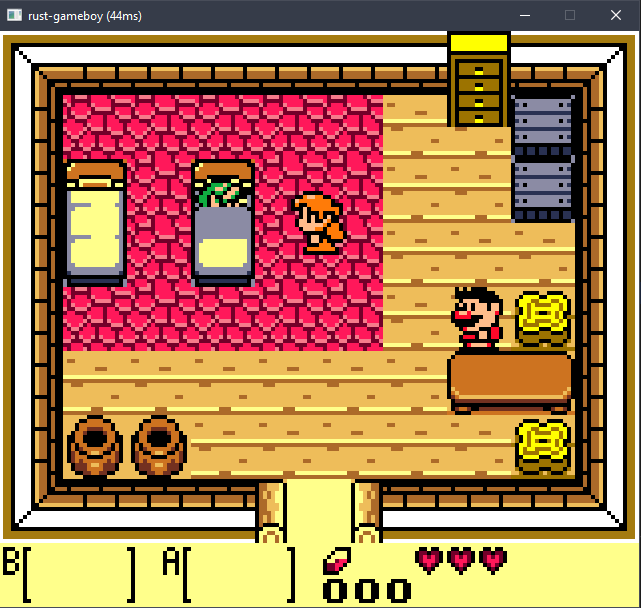

I wrote this emulator while learning about Rust. The emulator is complete, although some games that rely on specific quirks on the original
hardware might not work perfectly. 

For the most part it was able to play through any of the "popular" games including the amazing audio track in Zelda's splash screen.

Playing some Zelda Link's Awakening, I left the theme song playing for a while there, I just *LOVE* that theme, so powerful :)


Or some Tetris in a GameBoy Color mode:



The code is available at github: https://github.com/xamado/rust-gameboy

I'm sure there's lots of room for improvement, since I was learning Rust and the emulator was the excuse.
