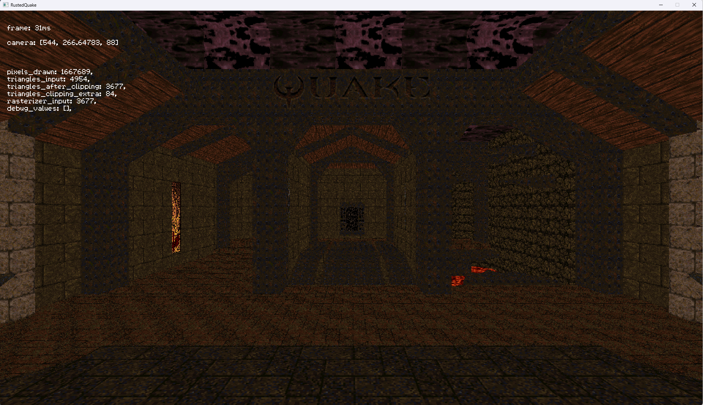
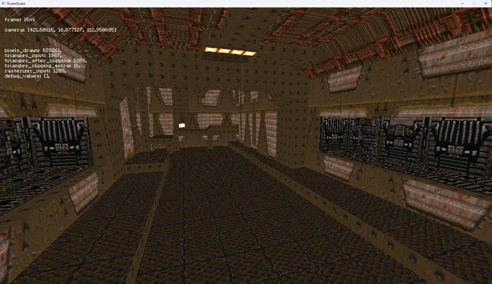

Decided to implement a software rasterizer in Rust, and what better way to do it than using Quake 1 levels?

Still working on this project but so far it supports:

* Vertex transform pipeline
* Rasterizer using barycentric coordinates (as opposed to Quakes scanline rasterizer)
* PVS for determining the leafs to render
* Texture mapping (using just mip 0 for now)

I still have lots of work to do on it, I haven't even started looking into optimizing it much. I did try
rasterizing triangles using tiles to skip big portions of "inside" pixels, but I didn't get as much improvement 
as I meant, so for now its disabled.

Repository available at: https://github.com/xamado/rusted-quake

