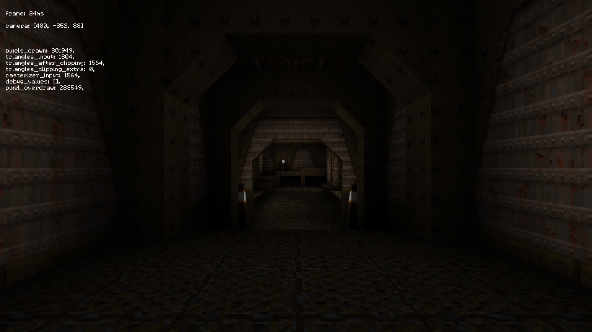
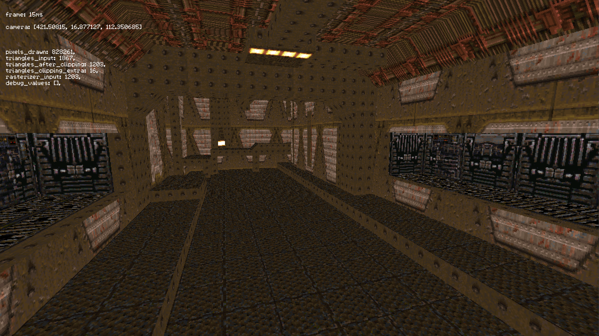

Decided to implement a software rasterizer in Rust, and what better way to do it than using Quake 1 levels? The goal of this project wasn't to recreate Quake 1, at least not originally, so I'm using a more standard baricentric rasterizing step, instead of a scanline approach like Quake used for performance reasons. My goal was to implement a GPU pipeline in software.

Still working on this project but so far it supports:

* Vertex transform pipeline
* Rasterizer using barycentric coordinates (as opposed to Quakes scanline rasterizer)
* BSP/PVS visibility queries
* Collision detection using collision hulls 
* Texture mapping
* Lightmapping

I still have lots of work to do on it, I haven't even started looking into optimizing it much. I did try
rasterizing triangles using tiles to skip big portions of "inside" pixels, but I didn't get as much improvement 
as I meant, so for now its disabled.

Repository available at: https://github.com/xamado/rusted-quake

