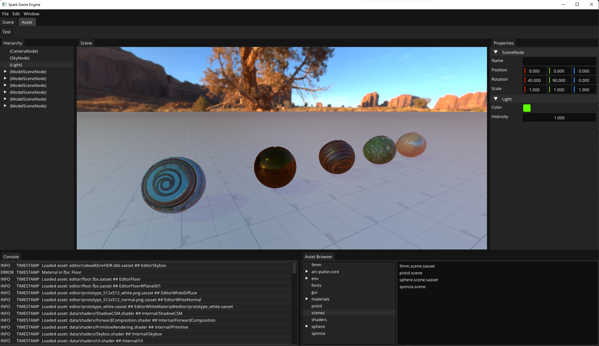
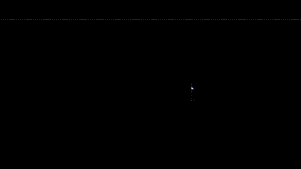

Spark is a Game Engine I have been working on for... ever. Started originally in 2009, but since it was always a pet/educational project I never really did anything with it, other than, well, learn! I don't have any delusions of ever it becoming anything other than a way for me to learn and research things that interest me.

Key features:
* Some C++ 20 features. I'm not keen on using modern C++ just because it exists, but there's a few things that I do like, like lambdas, std::function, auto for iterators and most recently std::format, which is much more clean than any string formatting ever before in C++.
* C++ Reflection system, allows for specifying constructors, methods and properties on objects which can be later queried and set from code, for example when parsing a scene file.
* Designed to be API agnostic, but currently only working on DirectX12.
* Embedded scripting using Mono/C#
* PBR renderer
* Dynamic Diffuse Global Illumination using Raytracing (RTX)
* Basic tools with scene editing, asset viewing/editing, asset browser, gizmos, etc.
* Texture loading from TGA, PNG, JPG or DDS files.
* Mesh loading from FBX files using the official FbxSDK

