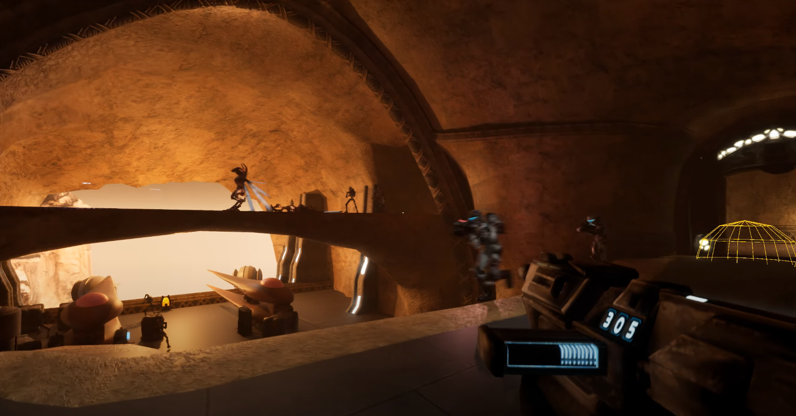
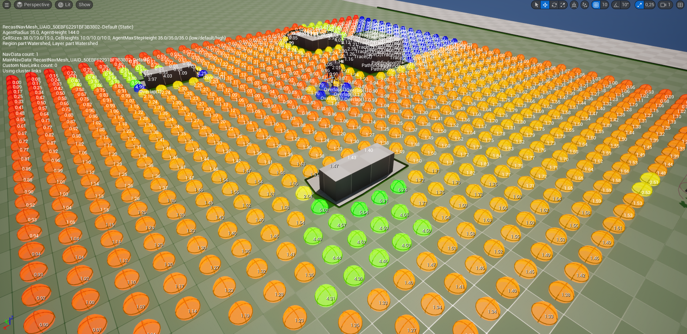

This is a quick prototype I did to bring back Republic Commando, a game originally developed on the Unreal 2 Engine, into modern UE5.

I spent quite a long time ripping models off the original game, the fact that it shipped with a version of UnrealEd made things a bit easier to know what goes where, but ripping of meshes, textures and "shaders" (not hardware accelerated) was a bit of a handiwork, and a lot of guesswork.

In terms of features I implemented a couple of weapons, basic gameplay progress, AI squad members and orders, some enemies and a sequencing system for gameplay events. Unreal 2 handled these way differently than what we have in the engine nowadays. It did help me understand why there's some useless features in UE5 that no one uses, but now I know where they came from.

Enemy and Squad AI made use of EQS (Environmental Query System) in order to pick their combat positions, taking into account flanking, cover, exposure to enemies, etc.

The old environments came to life incredibly with the use of Lumen and just the stock textures. Of course it could look even more impressive with proper modern PBR art, but the results where amazing none the less.



